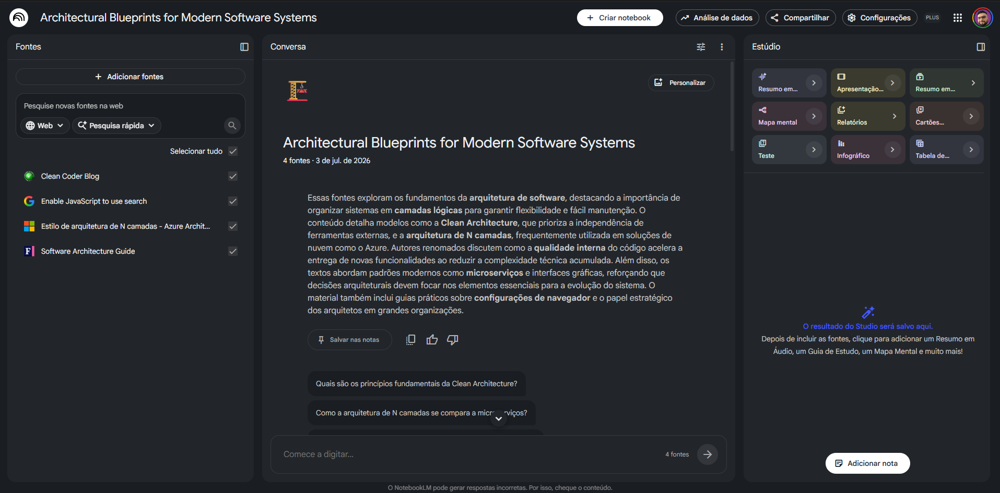
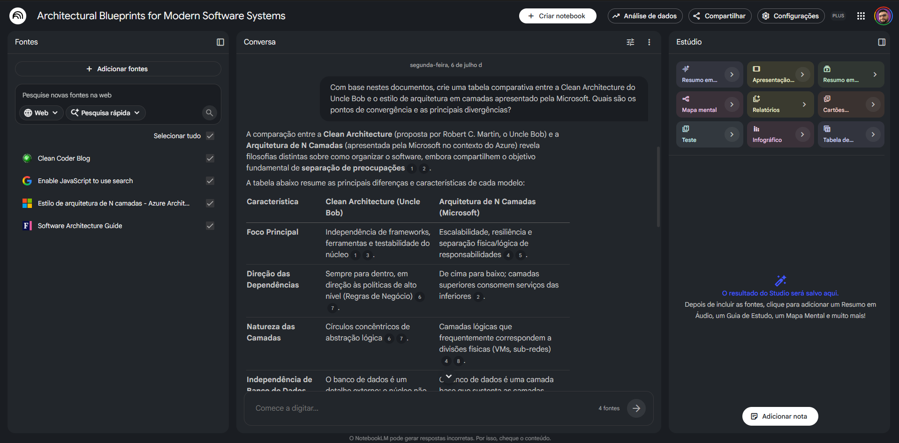

# Miniguia: Desbravando a Clean Architecture

## 1. Contexto e Objetivos
A **Clean Architecture**, proposta por Robert C. Martin (Uncle Bob), é uma filosofia de design de software que visa separar as preocupações (concerns) de um sistema em camadas, facilitando a manutenção, testabilidade e independência de frameworks, bancos de dados ou interfaces externas.

**Objetivos de Estudo:**
- Compreender a regra de dependência e como ela protege as regras de negócio.
- Identificar as responsabilidades de cada camada (Entities, Use Cases, Adapters, Frameworks).
- Aprender a aplicar esses conceitos em projetos práticos, garantindo um código mais desacoplado.

## 2. Curadoria de Fontes
Para este desafio, utilizei quatro fontes primárias de referência para garantir a qualidade técnica do material, conforme a configuração abaixo:

## 3. Engenharia de Prompts e "Cicatrizes"

Durante a elaboração deste caderno, enfrentei um desafio comum em pesquisas com IA: a "poluição" de conteúdos superficiais. Ao buscar por "Clean Architecture", muitos resultados eram artigos genéricos.

* **A "Cicatriz":** A IA inicialmente me forneceu comparações baseadas em posts de blogs secundários, que omitiam as nuances da filosofia de Uncle Bob. Tive que refinar minha curadoria, buscando links diretos dos autores originais (Uncle Bob, Martin Fowler, Microsoft Learn) para garantir a veracidade técnica.
* **Aprendizado (Troubleshooting):** Aprendi que a qualidade da resposta do NotebookLM é diretamente proporcional à autoridade das fontes inseridas. Quando a fonte é primária, a IA para de "chutar" e começa a sintetizar arquitetura de verdade.

**Exemplo de Prompt Utilizado:**
> "Com base nestes documentos (fontes primárias), crie uma tabela comparativa entre a Clean Architecture do Uncle Bob e o estilo de arquitetura em camadas da Microsoft, focando em divergências de dependência e flexibilidade."

## 4. Miniguia de Estudo
Abaixo, apresento a análise comparativa gerada através da interação com a IA:

### Glossário de Conceitos Chave
* **Regra de Dependência:** O princípio de que dependências de código só podem apontar para dentro (em direção às políticas de negócio).
* **Entities:** Objetos de domínio que contêm as regras de negócio de nível mais alto.
* **Use Cases:** Orquestram o fluxo de dados para e das entidades.
* **N-Tier:** Estilo arquitetural focado na separação física (UI, BLL, DAL).

### Prompts Reutilizáveis (Cheat Sheet)
* "Explique como aplicar [Conceito] em um projeto de [Linguagem/Framework]."
* "Identifique gargalos comuns em [Arquitetura] e proponha soluções de refatoração."
